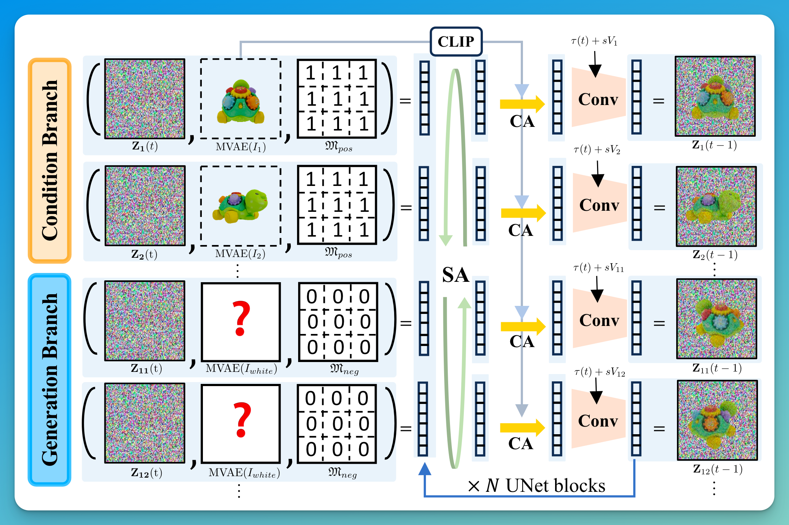

# MVDiffusion++
## Notes
task: novel view generation, single-view reconstruction, sparse-view reconstruction
main contribution: 
- pose-free architecture: without explicit camera pose information
- view dropout strategy

compare to related work:
- MVDiffusion: needs one-to-one image correspondences
- MVDream, Wonder3D, Zero123++: 3D self-attention, produce sparse, low-resolution images due to the computational intensity
- LRM, DMV3D: 3D volume limits its resolutions
- Syncdreamer: constructing a 3D cost volume, recover 3D structures using conventional reconstruction methods like Neus, requires substantial GPU memory
- Traditional 3D reconstruction methods: need camera pose estimation, which is difficult for Sparse View Image Reconstruction(SVIR)
- LEAP, PF-LRM: not based on generative models, lacking generative priors, and suffer from low-resolution outputs due to the use of volume rendering

architure:

## reproduce procedure
### dataset
training:
- Objaverse dataset, use 180k models whose aesthetic scores are at least 5 for training
- translate the bounding box center to the origin and apply uniform scaling so that the longest dimension matches $[−1, 1]$
- output camera centers are placed at a distance of 1.5 from the origin
- input condition views: 
	- azimuth angle: randomly chosen from $0,45^◦,90^◦,\dots$
	- elevation angle: randomly chosen from $[-10^◦,45^◦]$
	- distance of the camera center from the origin: randomly chosen from $[1.5, 2.2]$
	- Blender to render images

testing(single-view cases)
- Google Scanned Object
- borrow the rendered images and the evaluation pipeline from SyncDreamer
- 30 objects, each has 16 images with a fixed elevation of $30^◦$ and every $22.5^◦$ for azimuth

testing(sparse-view cases)
- render 10 condition images for each of the 30 GSO objects
- the azimuth and the elevation angles are chosen randomly from $[0, 360)$ and $[-10, 45]$ respectively
- render 32 ground-truth target images while aligning the azimuth of the first target view and the first input view
- vary the number of condition images to be 1, 2, 4, 8, and 10

### model
refer to [MVDiffusion official implementation](https://github.com/Tangshitao/MVDiffusion/tree/main)

Mask-aware VAE
- add additional input and output channels to handle the mask
- copy the network architecture and model weights of the default VAE
- use approximately 3 million RGBA images rendered from Objaverse to fine-tune M-VAE as a pre-processing
- follow the original VAE hyperparameters: 
	- base learning rate of 4.5e-6 
	- batch size of 64
- runs for 60,000 iterations

### training
View dropout training strategy:
- randomly drop 24 out of 32 views for each object at each training iteration
Three-stage training strategy:
1. train as an ε-prediction model only with single-view conditioning cases
2. fine-tune as a v-prediction model still with single-view conditioning cases
3. fine-tune as a v-prediction model with both single and sparse-view conditioning cases, half the samples are single-view conditioning, and the other half are sparse-view (randomly 2-10) conditioning
